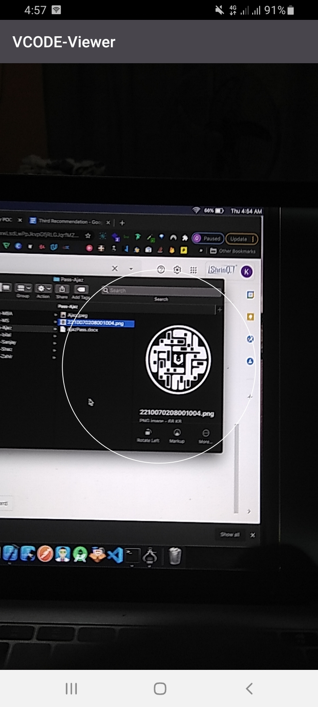
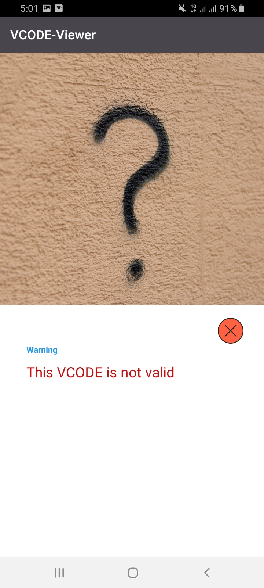

# VCODE Verify - Verify documents and people using VCODE
**VCODE is a new unique identifier and this application puts it to use for verifications**

## Features
* Scan VCODEs
* Get results on the authenticity of documents
* Verify people's identity

## Screenshots
 

   <table align="center" border="0" >
  <tr>
    <td>
      
    <td>
      
    </td>
    <td> 
     
    </td>
    <td> 
     
    </td>
    <td> 
     
    </td>
  </table>
  

 

### Author

* **Dankyi Anno Kwaku** 

